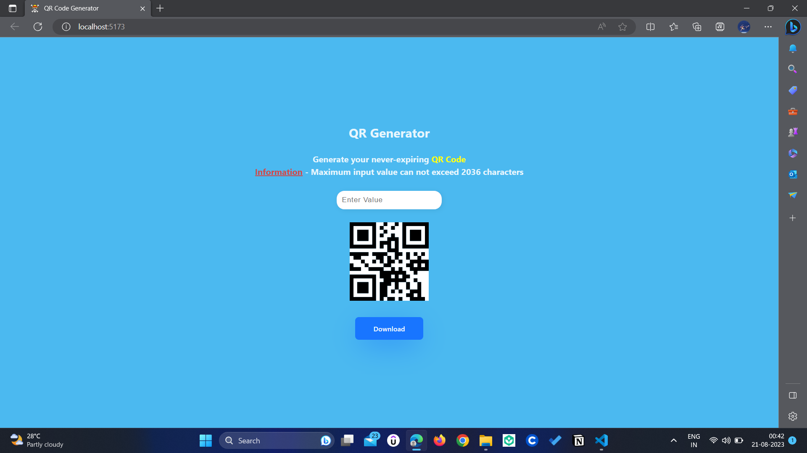

# QR Generator 🌐

Generate QR codes that will never expire, all for free! Say goodbye to limited usage and time-bound QR codes. Create your own QR codes with this simple, user-friendly React application.

## Motivation 🚀

Have you ever used online QR code generators for links, only to find that the generated QR codes expire over time or require purchasing a premium version? Say no more! This QR Generator was built with the intention of providing QR codes that will never expire, without any cost. Now you can create QR codes for your links and content, confident that they will remain usable indefinitely.

## Features ✨

- Generate QR codes for links, text, and more.
- QR codes are designed to never expire, ensuring long-term functionality.
- User-friendly interface with easy-to-use input options.
- Beautifully styled QR codes with customizable colors.

## How to Use 📝

1. Clone this repository to your local machine.
2. Install dependencies using `npm install`.
3. Start the development server with `npm run dev`.
4. Open your browser and navigate to `http://localhost:3000`.
5. Enter the content you want to generate a QR code for.
6. Click the "Generate QR Code" button.
7. Your QR code will be displayed along with a download button for the QR code image.

## Technologies Used 💻

- React - Frontend library for building user interfaces.
- Typescript - Adds static typing to JavaScript to catch errors at compile time.
- react-qr-code - Library for generating QR codes in React.
- HTML2Canvas - Library for capturing screenshots of HTML elements.

## Preview 📷

## Contributing 🤝

Contributions are welcome! Feel free to fork this repository, create a branch, and submit a pull request. Please make sure to follow the project's code of conduct.

## License 📄

This project is licensed under the [MIT License](LICENSE).

---

Created with ❤️ by Askari ([Askari64](https://github.com/Askari64))
